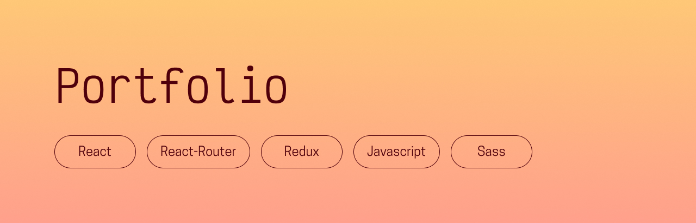

## Presentation
This is the code for my portofolio, which you can view [here](https://chloeadrian.dev/)!

## Prerequisites
- [NodeJS (version 16.17.0)](https://nodejs.org/en/)
- [NPM (version 9.4.0)](https://www.npmjs.com/)
- [React (version 18.2.0)](https://react.dev/)

## Getting started
- Run `$ npm install` to install all dependencies
- Run `$ npm start` to see the project!

## Thanks for reading, and happy coding!  
Chloé Adrian